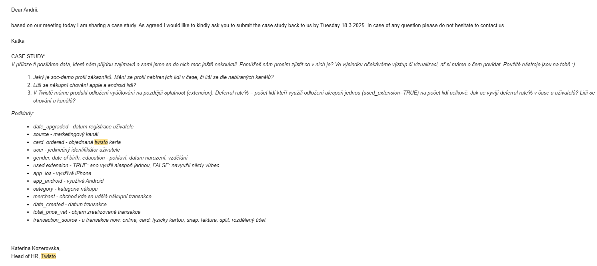

# Overview
Welcome to my analysis of the performance of a fintech company in the Czech Republic. This project focuses on [Twisto.cz](https://www.twisto.cz) and was created as part of a case study during an interview process.  

The dataset provided by the company includes information about new client registrations, customer demographics such as age, gender, and education, as well as details of transactions and the use of payment extensions. 

Using Python, I explored the data to better understand who Twisto’s customers are, how they behave when making purchases, and how often payments are deferred. The goal of this project is to present an accessible, data-driven overview of customer behavior and highlight insights that could support business and product decisions.

# The Questions
In this project, I aim to explore three main areas:

1. What is the socio-demographic profile of Twisto’s customers, and how does it change over time or by channel?
2. Do Apple and Android users differ in their purchasing behavior?
3. How do deferral rates develop over time, and do they vary across channels?



# Tools I Used
For this project, I worked with several tools that supported both analysis and presentation:

- **Python** – the main language for exploring the data  
  - **Pandas** for data analysis  
  - **NumPy** for numerical operations  
  - **Matplotlib** and **Seaborn** for visualizations  
  - **Streamlit** for creating simple interactive views  

- **Jupyter Notebooks** – to run code and document the analysis step by step  

- **Visual Studio Code** – for writing and testing Python scripts  

- **Git & GitHub** – for version control and sharing the project

# Data Preparation and Cleanup

This section outlines the steps taken to prepare the data for analysis, ensuring accuracy and usability.


## Import & Clean Up Data

I start by importing necessary libraries and loading the dataset, followed by initial data cleaning tasks to ensure data quality.

```python


```

## Filter Data

To focus my analysis on the

```python


```

# The Analysis

Each Jupyter notebook for this project aimed at investigating specific aspects of the data job market. Here’s how I approached each question:

## 1. ?


View my notebook with detailed steps here: []().

### Visualize Data

```python

```

### Results


* *

### Insights:


## 2. ?


View my notebook with detailed steps here: []().

### Visualize Data

```python


```

### Results

  
* *

### Insights:


## 3. ?


View my notebook with detailed steps here: []().

#### Visualize Data 

```python


```

#### Results

  
* *

#### Insights


# What I Learned


# Insights


# Challenges I Faced


# Conclusion


